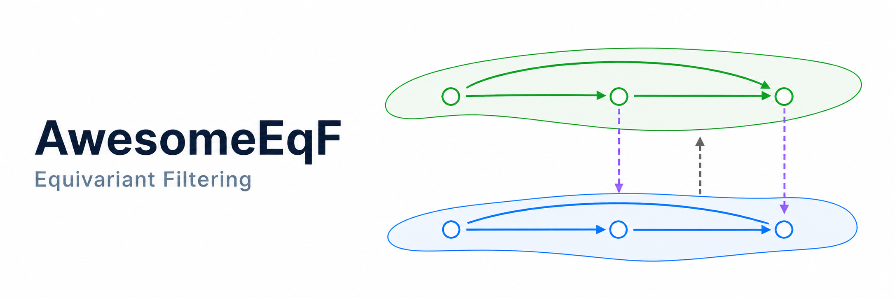

Hello and welcome to a curated collection of the latest and greatest literature on equivariant filtering! 

Explore:
- [Papers and Reading](papers.md) for a structured list of key literature 
- [Examples and Implementations](notebooks.md) to dive into code examples, made simple through the use of [GTSAM](https://github.com/borglab/gtsam)
- [Blog](blog.md) posts, updated with insights from time to time to explore cool things the community has learned about equivariant filters

**I have no idea what "EqFs" are!**  
  Check out the [intro blog post first](https://gtsam.org/2026/04/28/equivariant.html) on the GTSAM website for an explanation! Then, feel free to follow the **Papers and Reading** page for a structured list of key papers as per your interest.

**How do I properly use GTSAM?**  
  Check out the [GTSAM documentation](https://borglab.github.io/gtsam).

### 🤝 Community

This is a community-driven resource! Contributions are welcome:

- Add or refine entries in **Papers and Reading**
- Contribute new **notebook implementations** in `notebooks/`
- Writing **blog posts**
- Open issues or pull requests on GitHub

See the [Contributing Guide](https://github.com/borglab/AwesomeEqF/blob/main/CONTRIBUTING.md) for details.